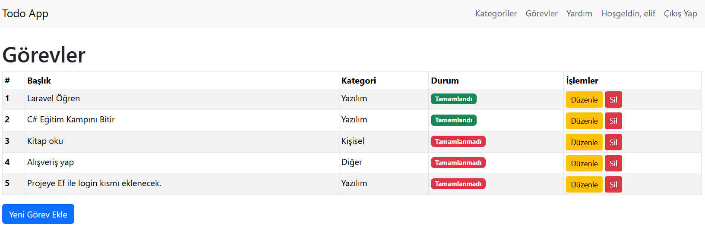
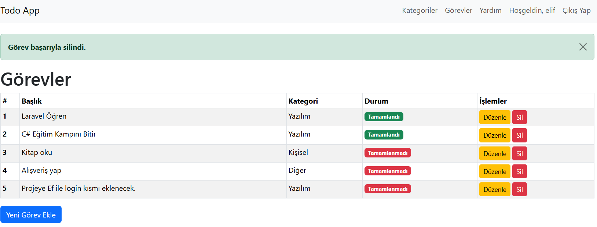

# 🎯 **Yapılacaklar Listesi (ToDoApp)** - Laravel PHP ile Görev Yönetim Uygulaması

Laravel framework’ü ile geliştirdiğim **Yapılacaklar Listesi (ToDoApp)** uygulaması, kullanıcıların görev ekleyip düzenleyebileceği, görevlerin tamamlandığını işaretleyip silebileceği, ayrıca kullanıcıların giriş yaparak kişisel görevlerini yönetebileceği bir görev yönetim sistemidir. 🚀

## 📋 **Özellikler**

- ✅ **Görev Ekleme**: Kullanıcılar yeni görevler ekleyebilir.
- ✏️ **Görev Düzenleme**: Mevcut görevler düzenlenebilir.
- ✅ **Görev Tamamlama/Tamamlanmamış Görevler**: Görevler tamamlandı olarak işaretlenebilir veya tamamlanmadı olarak işaretlenebilir.
- 🗑️ **Görev Silme**: İstenmeyen görevler silinebilir.
- 👤 **Kullanıcı Giriş/Kayıt Sistemi**: Kullanıcılar sisteme giriş yapabilir veya yeni bir hesap oluşturabilir.
- 🛠️ **CRUD Operasyonları**: Laravel’in Eloquent ORM yapısı ile veritabanı üzerinde CRUD işlemleri gerçekleştirilmiştir.

## 🛠️ **Teknolojiler**

- **PHP**: Laravel framework’ü ile backend geliştirme
- **MySQL**: Veritabanı yönetimi
- **Laravel Blade**: Kullanıcı dostu arayüz tasarımı
- **Laravel MVC**: Model-View-Controller mimarisi
- **Laravel Auth**: Kullanıcı girişi ve kayıt işlemleri için Laravel'in Authentication sistemi
- **Bootstrap**: Responsive ve şık bir kullanıcı arayüzü için  

## 🎨 **Görseller**

Projeyi daha iyi anlayabilmeniz için aşağıdaki ekran görüntülerini inceleyebilirsiniz:

  
*Görev Listesi Ekranı*

  
*Yeni Görev Ekleme Ekranı*

  
*Görev Başarıyla Silindi Ekranı*

  
*Görev Başarıyla Güncellendi Ekranı*

## 👨‍💻 **Kişisel Deneyim**

Bu proje, **PHP** ve **Laravel** konularında pratik yapmamı sağladı. Laravel’in MVC yapısının ve Eloquent ORM yapısının işleyişini daha iyi öğrenmemi, kullanıcı kimlik doğrulama (Authentication) sistemini kullanarak güvenli giriş ve kayıt işlemlerini entegre etmeme yardımcı oldu. Ayrıca, görevlerin yönetimi, durum takibi ve kullanıcı etkileşimi gibi özellikleri geliştirerek web uygulamalarında kullanıcı odaklı çözümler üretme konusunda deneyim kazandım. 🎓

